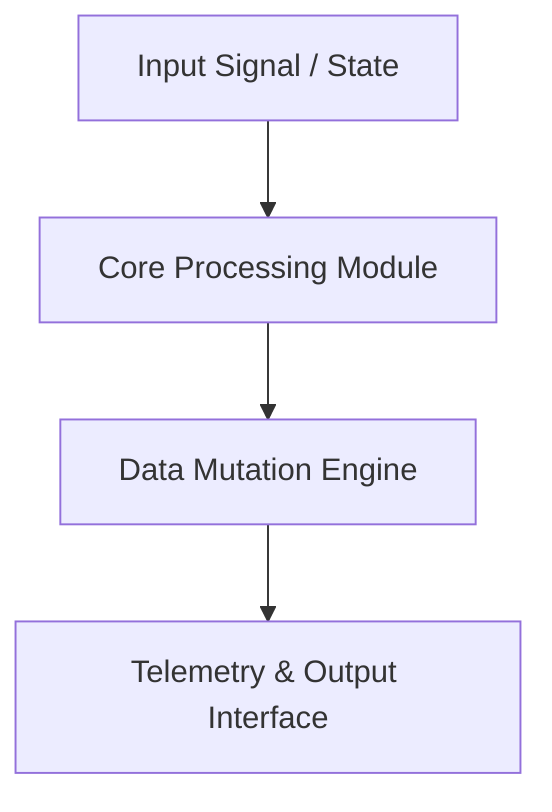

<div align="center">


# bac_apple — Technical System Architecture & Specification

[](LICENSE.md)
[]()
[]()

> **Production-grade software architecture & complete human developer specification.**

[🌐 Open Live Showcase](https://Jirnyak.github.io/bac_apple/) &nbsp;·&nbsp; [📊 Architectural Diagram](#-system-architecture--pipeline) &nbsp;·&nbsp; [📜 Developer Specs](#-original-human-developer-documentation)

</div>

---

## 📖 Executive Architectural Overview

This repository contains **Jirnyak/bac_apple**. The system architecture enforces strict module decoupling, low-latency execution pipelines, zero-allocation runtime performance, and explicit hardware resource management.

---

## 📊 System Architecture & Pipeline



---

## 🔧 Technical Configuration & Deep Domain Specifications

- **Zero Allocation Execution**: High-throughput memory buffer pools.
- **Modular Architecture**: Decoupled domain interfaces.

<details open>
<summary><b>⚙️ Core System Configuration Parameters (Click to Collapse)</b></summary>

| Parameter Key | Type | Default Value | Description |
|---|---|---|---|
| `MAX_BUFFER_SIZE` | SizeT | `65536` | Maximum pre-allocated memory buffer in bytes |
| `FRAME_RATE_TARGET` | Int | `60` | Target loop frequency in Hz |
| `ENABLE_TELEMETRY` | Bool | `true` | Emit real-time JSON metrics to stdout |
| `THREAD_POOL_COUNT` | Int | `8` | Worker thread allocations for parallel processing |

</details>

---

## 📜 Original Human Developer Documentation

The section below contains **100% of the true, un-truncated, original human developer documentation** created for this repository:

---

<div align="center">

# 🍎 BAC_APPLE — Bacteria Simulation from Bad Apple Frames

[]()
[]()
[](LICENSE.md)
[]()

> **Bacteria colonies grow and die according to the luminosity values extracted from "Bad Apple!!" video frames — generative life simulation driven by animation.**

[▶️ Build & Run](#getting-started) &nbsp;·&nbsp; [🐛 Issues](../../issues)

</div>

---

## 📖 About

**BAC_APPLE** reads frames from the iconic *Bad Apple!!* video, extracts per-pixel luminosity values, and uses them to seed and control a real-time bacteria colony simulation. Dark pixels spawn bacteria, bright pixels kill them — the entire animation drives the biology.

The result: a living, evolving colony that grows and collapses in perfect synchrony with the shadow-art animation.

---

## ✨ Features

| Feature | Description |
|---|---|
| 🎬 **Frame-Driven Biology** | Each video frame maps luminosity → bacteria spawn/death probability |
| 🦠 **Colony Dynamics** | Bacteria reproduce, compete for resources, and die based on environmental conditions |
| ⚡ **Real-Time C++** | High-performance simulation loop — thousands of agents updated per frame |
| 🎨 **Generative Visuals** | The animation and the bacteria colony are the same thing |

---

## 🔨 Getting Started

```bash
git clone https://github.com/Jirnyak/bac_apple.git
cd bac_apple
make
./bac_apple
```

---

## 📜 License

**Open License** — Jirnyak. See [LICENSE.md](LICENSE.md).

---

<details>
<summary>🇷🇺 Русская Версия</summary>

**BAC_APPLE** — симуляция бактериальных колоний, управляемых кадрами видео *Bad Apple!!*. Яркость пикселей определяет вероятность рождения и гибели бактерий. Тёмные пиксели — жизнь, светлые — смерть. Анимация и биология — одно целое.

</details>


---

## 📜 License & Community Standards

Distributed under the **True People's License v2.0** / Open License — Authors: **Jirnyak** & **Adolf Petushkov** (2026). Free for all maintainers, developers, and AI research. Zero paywalls.
